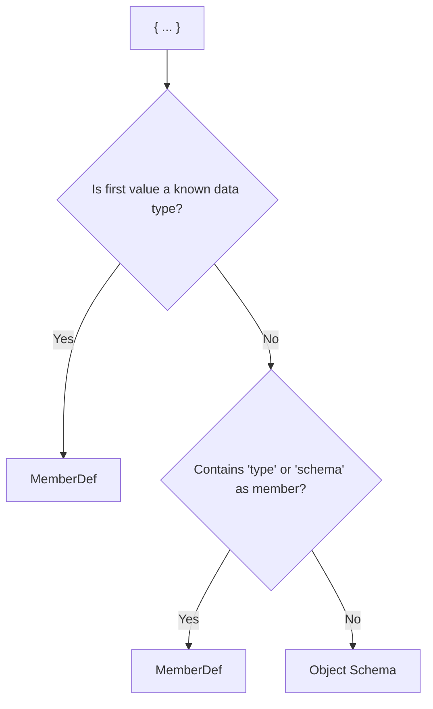

# MemberDef (with Object Schema Comparison)

A **MemberDef** (Member Definition) is the core way to define the type, validation rules, and constraints for a single value in an Internet Object schema. With MemberDefs, you can precisely control how each field is validated, using concise and powerful Internet Object syntax.

Every MemberDef is strictly validated against its type's [TypeDef](typedef.md), ensuring schema correctness and interoperability.

## What is a MemberDef?

A **MemberDef** is an IO object that defines:

* The **type** of a value (e.g., `number`, `string`, `object`, `array`)
* Any **validation rules, constraints, or options** for that value (e.g., `min`, `max`, `choices`, etc.)
* Optional **default value**, **nullability**, or **optionality** (using positional values and conventions)

**Only options and positional values defined in the** [**TypeDef**](typedef.md) **for that type are valid in MemberDefs.**

## MemberDef Syntax and Usage

A MemberDef is always a `{ ... }` object in Internet Object format, typically with:

* **Type** as the first value (by position or as a `type:` key)
* **Positional values** (like default or choices, if supported by the TypeDef)
* **Keyed options** (like `min:`, `max:`, `pattern:`, etc.)

**Examples:**

```ruby
# Type: number, min/max range
age: {number, min: 10, max: 99}

# Type: number, default: 20 (positional)
age: {number, 20}

# Type: int16, default 20, choices [10,20,30]
age: {int16, 20, [10, 20, 30]}

# Type: string, regex pattern
name: {string, pattern: "^[A-Za-z]+$"}

# Type: object with nested schema
meta: {object, schema: {
    author: string,
    version: {int, min: 1}
  }, default: {author: "Unknown", version: 1}}
```

### Optional, Nullable, and Default Values

* Add `?` for optional: `age?: {number, min: 10}`
* Combine: `score?*: {number, min: 0}`
* Use positional values for default and choices if the TypeDef for that type supports it.

## How MemberDefs Are Validated

* **Always** against the official [TypeDef](typedef.md) for the type.
* **Only keys and positions listed in the TypeDef are valid.**
* If you use an invalid key or value, validation fails.

### Valid MemberDefs

```ruby
# Valid MemberDefs with various types and constraints
age: {number, min: 10, max: 99}

# With 20 as default value
age: {number, 20}

# With choices [10,20,30,40,50] and default 20
age: {int16, 20, [10, 20, 30, 40, 50]}

# With constraints and nullability set specifically
age: {number, min: 10, max: 99, null: T}
```

### Invalid MemberDefs

```ruby
age: {number, minimum: 10, maximum: 99}  # ❌ 'minimum'/'maximum' not valid for number
age: {number, length: 10}                # ❌ 'length' not valid for number
```

> **Tip:** Always consult the [TypeDef reference](typedef.md) before adding constraints/options.

## Advanced: MemberDef with Nested Schema

Use the `schema:` key to define validation for nested object or array types:

```ruby
meta: {object, schema: {author: string, version: int}, required: ["author"]}
tags: {array, items: string, minLen: 1}
```

## Comparison: MemberDef vs Object Schema

While Object Schemas and MemberDefs share `{ ... }` syntax, their purpose and parsing are different:

* **MemberDef**: Validates a single value or field using type and constraints (the focus of this page)
* **Object Schema**: Defines the _shape_ of an object (what keys/fields it has, not how a value is validated)

### Brief Object Schema Definition

An **Object Schema** is a map of field names to types or MemberDefs, specifying the _shape_ of objects, e.g.:

```ruby
address: { street: string, city: string }
```

> Object Schemas do _not_ add constraints to individual values—they define what fields exist and their types or schemas.

## Why This Is Confusing (And How To Tell the Difference)

Because both use `{ ... }` syntax, it's easy to mix them up. Let's look at two lines:

```ruby
address: { street: string, city: string }           # Object Schema (declares fields/shape)
age: { int, min: 0, max: 120 }                      # MemberDef (type and constraints)
```

**Key distinction:**

* **MemberDef**: If first value is a type, or if `type`/`schema` is a member, it's a MemberDef.
* **Object Schema**: Otherwise, it's just a field map.

#### Quick Rules

1. **Is the first value a known data type?** → **Yes:** MemberDef → **No:** Go to 2
2. **Contains `type` or `schema` as a member?** → **Yes:** MemberDef → **No:** Object Schema

#### Flowchart



## Common Mistakes and How to Avoid Them

* **Using options not in the TypeDef:** Wrong: `age: {number, minimum: 10}`
* **Mixing constraints with object schemas:** Wrong: `{username: string, maxLen: 16}` (ambiguous!) Right: `username: {string, maxLen: 16}` inside an object schema
* **Omitting the type:** Always start with the type in a MemberDef

## Best Practices

* Use MemberDefs for all fields needing type and/or validation.
* Use Object Schemas to describe the field structure of nested objects only.
* Use positional values (default, choices) only if defined in the TypeDef for the type.
* Always cross-reference the [TypeDef reference](typedef.md).

## FAQ

**Q: Can I use both forms together?** A: Yes—use Object Schema for nested structure, MemberDef for each field (even nested).

**Q: What if my MemberDef contains a nested schema?** A: Use `schema: { ... }` inside the MemberDef for deep validation.

**Q: What error do I get if I use the wrong form or invalid key?** A: Validation fails, usually with a "type mismatch" or "unexpected/invalid field" error, depending on context and TypeDef.

**Q: Where do I find all valid options for each type?** A: See the [TypeDef reference](typedef.md).

## See Also

* [TypeDef documentation](typedef.md) — all allowed options for each type
* [Internet Object Schema Spec](schema.md)
* [IO Object Syntax](object.md)
