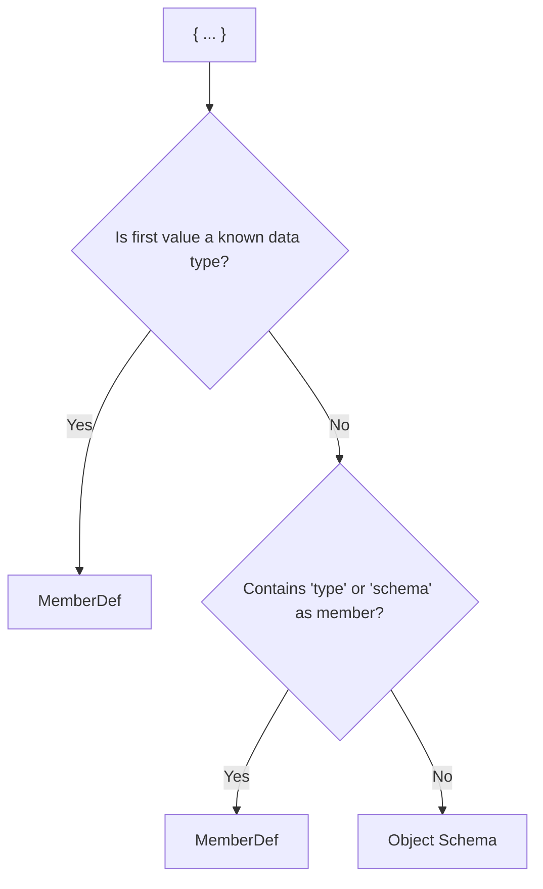

# **Object Schemas vs MemberDefs in Internet Object**

Internet Object aims to make schema writing expressive, compact, and as close to how developers *naturally describe data* as possible.
To achieve this, it offers two distinct—but related—constructs for describing fields:

* **Object Schema**: Describes the *shape* of a nested object (what fields it has, and their types).
* **MemberDef (Member Definition)**: Describes the *type* and any *constraints* (validation, choices) for a single field.

Both use curly-brace `{ ... }` syntax, which is powerful—but also a potential source of confusion.

## **Why This Is Confusing (And Why It Matters)**

Let's look at two schema lines:

```ruby
address: { street: string, city: string }
age: { int, min: 0, max: 120 }
```

Both use `{ ... }`. But:

* **One** declares an object's structure (fields: `street`, `city`)
* **The other** sets rules for a value (must be an integer in a certain range)

**How do you know which is which?**
And **why does it matter?**

### **If You've Ever Wondered…**

* "How does the parser know which one I meant?"
* "What if I want constraints *and* nested fields?"
* "Can I mix both in the same `{}`?"

**You're not alone.**
Making the distinction clear prevents errors, ensures validation works as you expect, and allows code generators and tools to do the right thing.

## **Quick Rules: Schema vs MemberDef**

**1. Is the first value inside `{ ... }` a known data type?**
→ **Yes:** This is a **MemberDef** (type and constraints)
→ **No:** Go to rule 2

**2. Does the object contain a member called `type` or `schema`?**
→ **Yes:** This is a **MemberDef**
→ **No:** This is an **Object Schema** (declares the fields in a nested object)

### **Visual Checklist (Flowchart)**



## **Detailed Examples**

| Schema Line                                    | What Is It?   | Reason                                     |
| ---------------------------------------------- | ------------- | ------------------------------------------ |
| `address: { street: string, city: string }`    | Object Schema | Declares shape of nested object            |
| `age: { int, min: 0, max: 120 }`               | MemberDef     | First value is a type; sets constraints    |
| `name: { string, maxLen: 100 }`                | MemberDef     | First value is a type; sets constraint     |
| `tags: { array, items: string }`               | MemberDef     | First value is a type; constraint on items |
| `profile: { username: string, email: string }` | Object Schema | Declares shape of nested object            |
| `testData: { schema: {a, b, c} }`              | MemberDef     | Contains 'schema'                          |
| `settings: { darkMode: bool, fontSize: int }`  | Object Schema | Declares fields for a nested object        |

## **Edge Cases and Advanced Patterns**

### **MemberDef with Nested Schema**

You can create a MemberDef for an object type, specifying *both* its type and its field schema (useful for complex constraints):

```ruby
meta: { object, schema: { author: string, version: int }, required: ["author"] }
```

* Here, `meta` is a MemberDef: first value is `object`
* It further provides a `schema` property, defining the allowed fields.

### **Array Constraints**

```ruby
numbers: { array, items: int, minLen: 1 }
```

* `numbers` must be an array, each item an int, with at least one item.

## **Common Mistakes (And How to Avoid Them)**

* **Mistake:** Using a MemberDef when you want a nested object's shape.

  * **Wrong:** `address: { string, minLen: 10 }`
  * **Right:** `address: { street: string, city: string }`
* **Mistake:** Mixing constraints with field declarations.

  * **Wrong:** `{ username: string, maxLen: 16 }` *(This is ambiguous!)*
  * **Right:** `username: { string, maxLen: 16 }` inside an object schema.

## **Design Rationale**

Why does Internet Object make this distinction?

* It lets you write schemas that are as **concise as your data**, but with validation power where you need it.
* You only add complexity (MemberDef) when you need extra validation or control.
* By separating "shape" and "validation," you avoid the verbosity and repetition of other schema systems.

## **Best Practices**

* **Use Object Schema** when you want to describe the fields of a nested object.
* **Use MemberDef** when you want to constrain or document the type/range/validation of a value.
* If in doubt, look at the **first value in `{ ... }`**—if it's a type, it's a MemberDef.
* Use the `schema` property inside a MemberDef for deep validation of objects.

## **FAQ**

**Q: Can I use both forms together?**
A: Yes, you can use an Object Schema for structure and MemberDef for individual fields, and even embed one inside the other.

**Q: What if my MemberDef contains a nested schema?**
A: Use `schema: { ... }` inside a MemberDef to define the nested structure.

**Q: What error do I get if I use the wrong form?**
A: Validators may fail with a "type mismatch" or "unexpected field" error, depending on the context.

**Q: Why not always use MemberDef?**
A: For simple objects, it's much easier and clearer to use object schemas. MemberDefs are for validation and fine-grained control.

## **For Implementers**

* **Canonicalization:** Always canonicalize schemas internally, so that the distinction between object schema and memberdef is clear for code generation, validation, and conversion to formats like JSON Schema or Avro.
* **Parsing Logic:**

  * If first value in `{}` is a type, treat as MemberDef.
  * If not, and there's no `type` or `schema`, treat as object schema.
  * Always check for conflicting properties or ambiguous cases.

## **Appendix: Mapping to JSON Schema**

| Internet Object             | JSON Schema Equivalent                                                   |
| --------------------------- | ------------------------------------------------------------------------ |
| `{ street: string }`        | `{ "type": "object", "properties": { "street": { "type": "string" } } }` |
| `{ int, min: 0 }`           | `{ "type": "integer", "minimum": 0 }`                                    |
| `{ object, schema: {...} }` | `{ "type": "object", "properties": ... }`                                |

*You can link to this document from your main schema docs, from "More Info" tooltips, and from validation error explanations for maximum clarity and user-friendliness!*

Let me know if you want to add more examples, include diagram mockups, or tailor this further for a particular audience or style!
