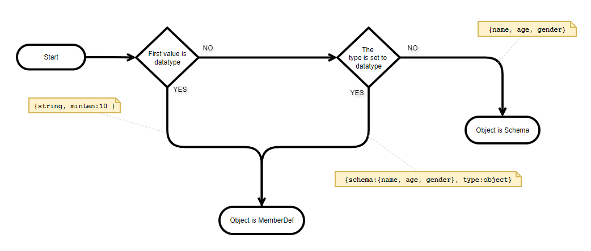

# Is Object, a MemberDef or a Schema?


An object can be represented as a MemberDef or a Schema. Object as a MemberDef can be easily differentiated from Object as a schema using some rules expressed in the flowchart below.&#x20;

<figure><figcaption></figcaption></figure>

#### When the first value is a datatype&#x20;

If the first value in the object is a string and [valid datatype](data-types/) such as number, string, object, bool, etc. then the object is a MemberDef. In the following example, the `name` is a MemberDef, because it defines the string value.



```ruby
name: { string, maxLen:100 } # MemberDef
```



#### When the object contains type

If the object has a type member then it is parsed as MemberDef. In the following example, `testScore` is a MemberDef, as it defines the type of object.



```ruby
dataType: { schema:{type:string, len:number}, type: object } # MemberDef
```



#### If the object contains schema

If the object contains schema then it is a MemberDef. In the following example, `testData` is a MemberDef, because it contains schema.



```ruby
testData: {  default: { }, schema: {a, b, c}  } # MemberDef
```



#### &#x20;If  the schema is set to an array in the object

If the schema inside the object is set to an array then it is a MemberDef. In the following example, `subjectMarks`  is a MemberDef, because it contains the schema of an array.&#x20;



```ruby
subjectMarks: {  default: { }, schema: [int]  } # MemberDef
```



####

#### If the object does not fall under any conditions given above

If the object does not fall under any of the above conditions then it is not a MemberDef. It is a schema of an object. The following example represents the object schema.



```ruby
name, age, address, isActive, remark # schema of an object
```



