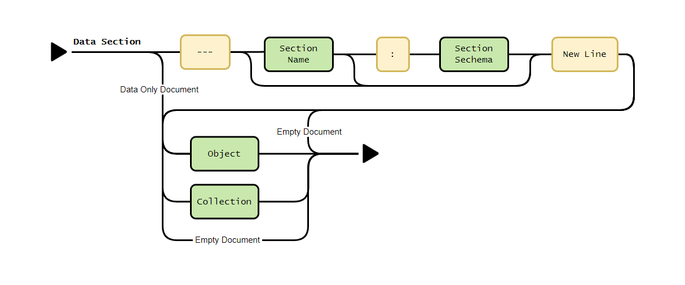

# Data Sections

The Data Section in an Internet Object Document is where the actual data resides. An internet Object document can have one or more Data Section. It consists of one or more sections, each defined by a separator line (`---`) and optionally accompanied by a section name and schema. The data itself can be represented as either a single object or a collection of objects, allowing for a flexible and structured approach to data representation. Following diagram shows the structure of the Data Section.

  <!-- Placeholder for new syntax diagram -->

## Structure Overview

### Section Separator Line

Each Data Section begins with a separator line (`---`), which organizes the document into distinct sections. The separator line can include optional elements:

- **Section Name**: Identifies the section and its purpose.
- **Schema Name**: Defines the structure or constraints of the data, prefixed with `$`.

> ℹ️ The separator line must end with a newline character (`\n`) or EoF (End of File).

The separator line can take on various forms for different levels of detail, each ending with a newline character (`\n`) or EoF (End of File):

- **Without Name and Schema**: The simplest form, just the separator (`---`).
- **With Section Name**: The separator followed by a section name (`--- employee`).
- **With Section Name and Schema**: The separator followed by a section name and a schema name, separated by a colon (`--- employee : $employee`).
- **With Only Schema**: The separator followed by just the schema name (`--- $employee`).

### Rules for Section Names and Schemas

- **Omitting Section Name**: In a multi-section document, the section name can be omitted only once. When omitted, the section name will be derived from the associated schema (e.g., `--- $employee` implies that the section name is `employee`).
- **Default Section Name and Schema**: If both the section name and schema are omitted, the section name will default to `data`, and a default schema will be used.
- **Unique Section Names**: Each section in an Internet Object Document must have a unique section name. Duplicate section names are not allowed.

### Examples of Section Separator

#### Separator Line without Name and Schema

It is the simplest form of the separator line. It will use the default section name (data) and the default schema set for the document.

```ruby
---
~ John Doe, 25, Male, {Bond Street, New York, NY}, [agile, swift]
~ Jane Doe, 20, Male, {Duke Street, New York, NY}
```

#### Separator Line with Section Name (employee)

Here the section name is `employee`. The schema will be the default schema set for the document.

```ruby
--- employee
~ John Doe, 25, Male, {Bond Street, New York, NY}, [agile, swift]
~ Jane Doe, 20, Male, {Duke Street, New York, NY]
```

#### Separator Line with Section Name and Applicable Schema

Here the section name and schema are both are explicitly mentioned as `employee` and `$employee` respectively.

```ruby
--- employee : $employee
~ John Doe, 25, Male, {Bond Street, New York, NY}, [agile, swift]
~ Jane Doe, 20, Male, {Duke Street, New York, NY]
```

#### Separator Line with Only Schema

Here only the schema is mentioned. The section name will be derived from the schema name (employee). However, if the document the section name is already used, then it will be an error.

```ruby
--- $employee
~ John Doe, 25, Male, {Bond Street, New York, NY}, [agile, swift]
~ Jane Doe, 20, Male, {Duke Street, New York, NY}
```

### Data

After the separator line, the data within a section is introduced. This data can either be a single object or a collection of objects. The flexibility in data representation allows the Internet Object Document format to handle various types of information efficiently.

#### Objects

Objects are structured data entities composed of key-value pairs. Each object is defined within curly braces `{}` and can contain nested objects or other data types, forming a hierarchical structure.

#### Collections

Collections represent a list of objects, making it possible to include multiple records within a single Data Section. Each object within a collection is defined in the same way as a standalone object but is part of a broader collection context.

### Examples of Data

#### Single Object

A single object can be represented after the separator.

```ruby
---
John Doe, 25, Male, {Bond Street, New York, NY}, [agile, swift]
```

It is not necessary to have a section separator for a single section document if there is no header or schema. Hence, the above example can be written as:

``` ruby
John Doe, 25, Male, {Bond Street, New York, NY}, [agile, swift]
```

#### Collection of Objects

A collection is represented by listing objects, each prefixed with `~` on separate lines:

```ruby
---
~ John Doe, 25, Male, {Bond Street, New York, NY}, [agile, swift]
~ Jane Doe, 20, Male, {Duke Street, New York, NY}
```

### Empty Data Section

You can have an empty data section. An empty data section can be represented by just the separator line without any data.

```ruby
---
```

It is not necessary to have a section separator for an entirely empty document.

```ruby
```

### Multi-Section Document Example

An Internet Object Document can include multiple sections, each with its own data:

```ruby
--- $library
# Bookville Library
City Central Library, "123 Library St, Bookville"

--- $books
~ The Great Gatsby, "F. Scott Fitzgerald", 1234567890, T, [Fiction, Classic], 1925
~ "1984", George Orwell, 2345678901, F, [Fiction, Dystopian], 1949, { user123, d"2024-02-20"}

--- subscribers: $users
~ user123, John Doe, Standard, [{2345678901, d"2024-01-20"}]
~ user456, Jane Smith, Premium, []
```

The Data Section, organized by separators and structured using objects and collections, offers a robust and flexible method for handling data within Internet Object Documents. This structure ensures that the documents are clear, consistent, and effective for a wide range of applications.
