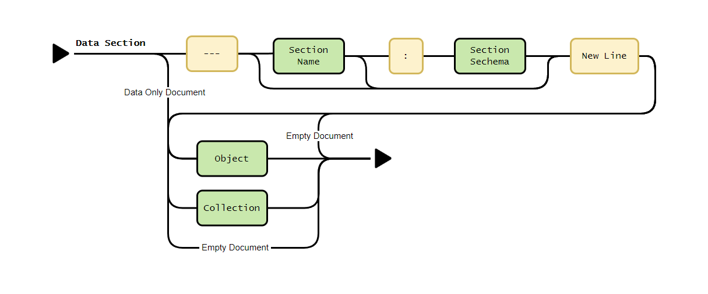

# Data Sections

The data section is where the actual data of an Internet Object document resides. A document
can have one or more data sections, each introduced by a separator line (`---`) and optionally
labelled with a section name and schema. The data itself is either a single object or a
collection of objects, giving a flexible yet structured way to represent information. The
diagram below shows the shape of a data section.



## Structure overview

### Section separator line

Each data section begins with a separator line (`---`) that divides the document into distinct
sections. The separator can carry two optional elements:

* **Section name** — identifies the section and its purpose.
* **Schema name** — names the schema that constrains the section, prefixed with `$`.

> **Separator line.** The separator line must end with a newline (`\n`) or EOF (end of file).

The separator can take several forms, from least to most detailed, each ending with a newline
(`\n`) or EOF:

* **Without name and schema** — the simplest form, just the separator (`---`).
* **With section name** — the separator followed by a name (`--- employee`).
* **With section name and schema** — a name and schema name, separated by a colon
  (`--- employee : $employee`).
* **With only schema** — the separator followed by just the schema name (`--- $employee`).

### Rules for section names and schemas

* **Omitting the section name** — in a multi-section document, the section name may be omitted
  only once. When omitted, the name is derived from the associated schema (e.g. `--- $employee`
  implies the section name `employee`).
* **Default section name and schema** — if both the name and schema are omitted, the section
  name defaults to `data` and the document's default schema is used.
* **Unique section names** — each section must have a unique name; duplicate names are not
  allowed. A document that repeats one is **invalid**, but a parser still recovers from it: the
  duplicate is renamed (`data` → `data_2`, `users` → `users_2`) and the error is reported, so no
  section is lost. See
  [Duplicate section names](../../parsing-and-errors/error-accumulation.md#duplicate-section-names).

### Examples of section separators

#### Separator line without name and schema

The simplest form. It uses the default section name (`data`) and the document's default schema.

```ruby
---
~ John Doe, 25, Male, {Bond Street, New York, NY}, [agile, swift]
~ Jane Doe, 20, Male, {Duke Street, New York, NY}
```

#### Separator line with a section name

Here the section name is `employee`. The schema is the document's default schema.

<!-- io:test skip -->
```ruby
--- employee
~ John Doe, 25, Male, {Bond Street, New York, NY}, [agile, swift]
~ Jane Doe, 20, Male, {Duke Street, New York, NY}
```

#### Separator line with a section name and schema

Here both the name and schema are stated explicitly, as `employee` and `$employee`.

<!-- io:test skip -->
```ruby
--- employee : $employee
~ John Doe, 25, Male, {Bond Street, New York, NY}, [agile, swift]
~ Jane Doe, 20, Male, {Duke Street, New York, NY}
```

#### Separator line with only a schema

Here only the schema is named. The section name is derived from the schema name (`employee`).
If that name is already used elsewhere in the document, it is an error.

<!-- io:test skip -->
```ruby
--- $employee
~ John Doe, 25, Male, {Bond Street, New York, NY}, [agile, swift]
~ Jane Doe, 20, Male, {Duke Street, New York, NY}
```

### Data

After the separator line comes the data. It is either a single object or a collection of
objects — the flexibility that lets the format carry many kinds of information efficiently.

#### Objects

Objects are structured entities composed of key-value pairs. Each object is written within
curly braces `{}` and may contain nested objects or other values, forming a hierarchy.

#### Collections

Collections are lists of objects, allowing multiple records within one data section. Each
object in a collection is written the same way as a standalone object but belongs to the
broader collection. See [Collection](../../the-collections/collection.md) for record syntax,
type promotion, and validation rules.

### Examples of data

#### Single object

A single object can follow the separator directly.

```ruby
---
John Doe, 25, Male, {Bond Street, New York, NY}, [agile, swift]
```

A single-section document with no header or schema does not need a separator, so the example
above can also be written as:

```ruby
John Doe, 25, Male, {Bond Street, New York, NY}, [agile, swift]
```

#### Collection of objects

A collection lists objects, each prefixed with `~` on its own line:

```ruby
---
~ John Doe, 25, Male, {Bond Street, New York, NY}, [agile, swift]
~ Jane Doe, 20, Male, {Duke Street, New York, NY}
```

### Empty data section

A data section may be empty — just the separator line with no data.

```ruby
---
```

An entirely empty document needs no separator at all.

```ruby
```

### Multi-section document example

A document can include multiple sections, each with its own data:

<!-- io:test skip -->
```ruby
--- $library
# Bookville Library
City Central Library, "123 Library St, Bookville"

--- $books
~ The Great Gatsby, "F. Scott Fitzgerald", 1234567890, T, [Fiction, Classic], 1925
~ "1984", George Orwell, 2345678901, F, [Fiction, Dystopian], 1949, { user123, d"2024-02-20"}

--- subscribers: $users
~ user123, John Doe, Standard, [{2345678901, d"2024-01-20"}]
~ user456, Jane Smith, Premium, []
```

Organized by separators and built from objects and collections, the data section offers a
robust, flexible way to carry data — keeping documents clear, consistent, and effective across
a wide range of applications.

## See Also

- [Header](header.md) — what precedes the `---` separator
- [Objects](../values/object.md) · [Arrays](../values/array.md) — value syntax
- [Collections](../../the-collections/collection.md) — records and collection rules
